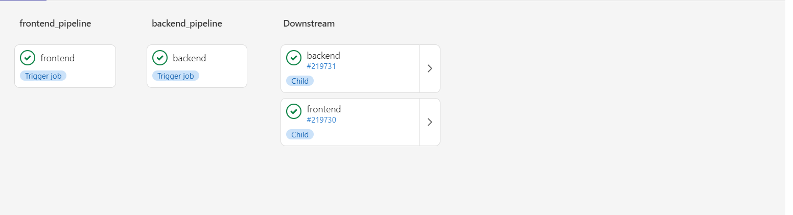
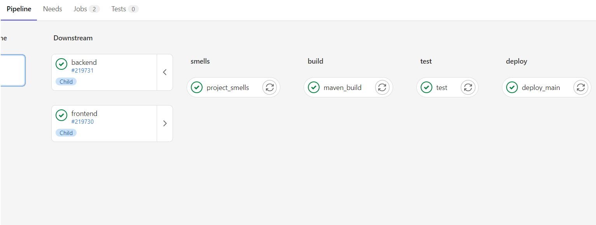
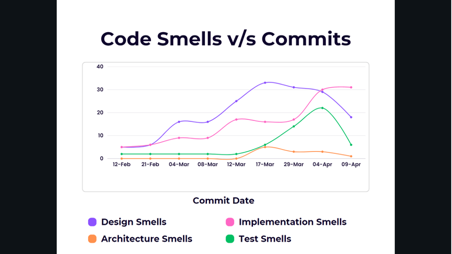
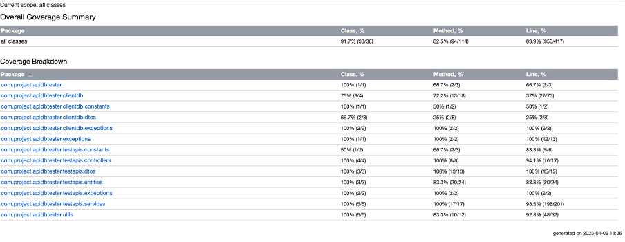

# API Database Tester

An application which allows you to automate and test API and database together 💥💥. 


**TECH STACK:**

Frontend - React.js

Backend - Spring Boot

client project - Spring Boot

## Project setup

### Frontend

1. Clone the project

```
git@git.cs.dal.ca:courses/2023-winter/csci-5308/group16.git
```

2. Download all the dependencies

```
cd frontend/api-tester
npm install
```

The react application will be started now and you will see a new page on your browser.

3. Build
On the same root folder, run the following command

```
npm run build
```

This will generate a new build folder which will have all the static files which can be then added to deployment server to deploy

React dependencies:

1. "@emotion/react": "^11.10.6",
2. "@emotion/styled": "^11.10.6",
3. "@mui/icons-material": "^5.11.11",
4. "@mui/lab": "^5.0.0-alpha.122",
5. "@mui/material": "^5.11.11",
6. "axios": "^1.3.4",

### Backend

we already cloned the repo while running frontend, since our backend code and frontend code are in same repo we dont need to clone again.

Best way to run is obviously using any IDE like IntelliJ which will download all the depencies and can run the application using GUI.

#### To run the application from CMD using maven

**NOTE: we also need client application to run test the application. Its details are provided in next section.**

Make sure you have maven installed in your system.

1. Start spring boot server

```
cd backend/api-db-tester
mvn spring-boot:run
```
This will start the backend application.

2. Run unit test

```
mvn test
```

3. Create jar file for deployment

```
mvn clean package
```
This will generate a jar file which will be then deployed on the server.

**Maven dependencies:**

1. spring-boot-starter-web

2. mysql-connector-j

3. spring-boot-starter-data-jpa

4. spring-boot-starter-test

5. spring-boot-starter-validation

6. lombok

7. spring-boot-devtools

8. rest-assured

9. modelmapper

10. json

11. junit

## Client application.

To do the testing, development and demo, example APIs with database is required. This is project will be then used as client project for our application.

LINK: https://git.cs.dal.ca/shubhamm/demo-api-application-maven

This is just a simple spring boot application and steps to run are same as any other spring boot application.

This application is also already deployed and can be accessed using this server.

```
http://csci5308vm16.research.cs.dal.ca:9191/
```

Example: To get all the producers from the producers tables use the end point.

```
http://csci5308vm16.research.cs.dal.ca:9191/producers
```


## CI/CD

### Gitlab pipeline:

All the builds and deployment of the application happens automated in the gitlab pipeline.

The pipeline performs all the steps of the build and depencies installation and copies the required content to the VM using scp to the required folders need to deployment. The deployment details are provide below.

**Architecture:**

The pipeline in the project used Mutli-project pipelines architecure.

Official documentation by gitlab: https://docs.gitlab.com/ee/ci/pipelines/downstream_pipelines.html#multi-project-pipelines

Since there are two project in one repo (backend and frontend) using this architecture we can have a yml file for each project and these yml files will be triggered by a root yml file which will be in the root folder of the project.


Here is the example of how pipeline looks:



### Deployment

**The deployment is automated using pipelines.** The deployment will be triggered for every merge of the main branch.

The other details of how the deployment is done for both frontend and backend is given below:

**FRONTEND DEPLOYMENT**:

The deployment is done using nginx static server. For the frontend deployment there is a server folder made by nginx on the vm in the folder /var/www/${hostname}. The server looks for index.html file and serves it.

Now that we have our server ready we just need to add and remove build content from our pipeline to deploy the frontend application using the command in our pipeline.

```
scp -r -o StrictHostKeyChecking=no -i "${DEPLOYMENT_PRIVATE_KEY}" frontend/api-tester/build/* "$USERNAME@$HOST:/var/www/csci5308vm16.research.cs.dal.ca/"
```

**BACKEND DEPLOYMENT**:

For deployment of spring boot we need to create an executable jar file from our pipeline. The jar file creation is already mentioned above. The same process will be done in the pipeline.

Running spring boot application as linux service:

To forever keep running the application a linux service is created. This service can be found in /etc/systemd/system.

Run the service using following command.

```
systemctl start backend.service
```

All we need to do is to add the jar file to folder /home/backend and start the service. These all are already automated in pipeline.

```
scp -r -o StrictHostKeyChecking=no -i "${DEPLOYMENT_PRIVATE_KEY}" backend/api-db-tester/target/*.jar "$USERNAME@$HOST:/home/${USERNAME}/backend/api-db-tester-0.0.1-SNAPSHOT.jar"
```

Then the service needs to restarted:

```
systemctl restart backend.service
```

### Code quality tool in CI

Using "designite" java as a code quality tool in the CI. Designite is integrated as pipeline job. Its goes through the application code and generate reports and excel files, these excel files are then accessed using gitlab pipeline artifacts.

```
project_smells:
  stage: smells
  script:
    - cd backend
    - mkdir smells/
    - pwd
    - java -jar .gitlab/DesigniteJava.jar -i api-db-tester -o smells/ -d
  artifacts:
    paths:
      - backend/smells/
      - backend/api-db-tester
```

Example of the files generated can be found here: https://git.cs.dal.ca/courses/2023-winter/csci-5308/group16/-/jobs/969769/artifacts/browse/backend/smells/

We also made analysis of our code smells throughout the development. The following graph shows the anayalsis of all types of smells.



The code smells and their status can be found here: [Code smell analysis](./documentation/code-smell-analysis) 

### User scenarios:

**Connecting to Client Application’s database:**

1. Enter database credentials:

a. Username

b. Password

c. Url

2. Click on Test button.

3. Connection successful/failed message is displayed.

4. If successful, proceed to testing, otherwise try again.

Testing the Client Application’s APIs:

**Testing POST API:**

1. Choose type as POST.

2. Enter the POST API’s URL that is to be tested.

3. Enter the JSON payload required by the API.

4. Choose the table that is modified by the API i.e in which POST API would make insertion.

5. Select the columns that need to be tested. Enter the expected values of those columns. Multiple columns can be selected one by one.

6. Click on Test button.

7. Test result is displayed.

8. It shows the response code and message from the API.

9. It also shows the list of columns with their expected and actual values and whether the test passed or failed.

**Testing PUT API:**

1. Choose type as PUT.

2. Enter the PUT API’s URL that is to be tested.

3. Enter the JSON payload required by the API.

4. Choose the table that is modified by the API i.e in which PUT API would make changes.

5. Select the columns that need to be tested. Enter the expected values of those columns. Multiple columns can be selected one by one.

6. Click on Test button.

7. Test result is displayed.

8. It shows the response code and message from the API.

9. It also shows the list of columns with their expected and actual values and whether the test passed or failed.

**Testing GET API:**

1. Choose type as GET.

2. Enter the GET API’s URL that is to be tested.

3. Choose the table from which the API fetches the data.

4. Select the columns that need to be tested. Enter the expected values of those columns. Multiple columns can be selected one by one.

5. Click on Test button.

6. Test result is displayed.

7. It shows the response code and message from the API.

8. It also shows the list of columns with their expected and actual values and whether the test passed or failed.

**Testing DELETE API:**

1. Choose type as DELETE.

2. Enter the DELETE API’s URL that is to be tested.

3. Choose the table from which the API deletes the data.

4. Click on Test button.

5. Test result is displayed.

6. It shows the response code and message from the API.

**Test History:**

Whenever a new test is performed, it gets added to the list of test cases performed. The list contains the API URL, API type and result of the test.

The screenshots of the outputs can be seen in this folder:

[User Scenario Screenshots](./documentation/UserScenarioScreenshots.pdf)

### Design principles:

Throughout the development we followed design principles like SOLID. The detailed review can be found here.

[Design Principles Followed](./documentation/DesignPrinciples.pdf)


Test coverage report:




Api Documentation can be found here: [API Documentation](./documentation/ApiDocumentation.pdf)

Final Presentation Link: [Final Presentation](./documentation/Presentation.pptx)

Contribution statement: [Contribution Statement](./documentation/ContributionStatement.xlsx)